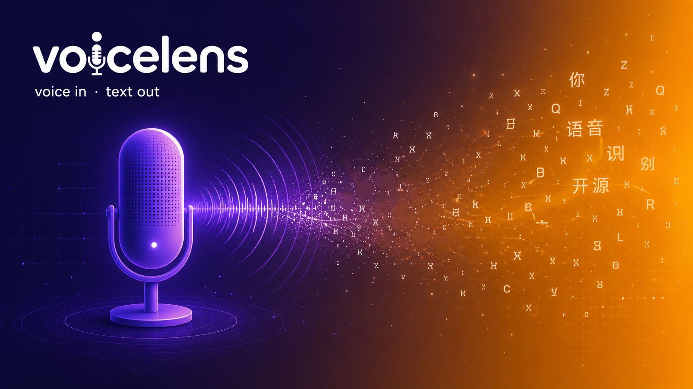
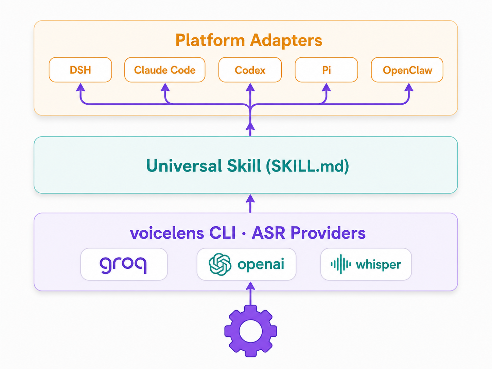

<!--
  配图占位：请在 docs/assets/ 放入以下图片后取消对应行的注释。
  图片清单（可用 GPT image-2 生成）：
    1. banner.png      —— 横版封面：一只麦克风 + 流动的文字，暖色渐变，科技感
    2. architecture.png —— 三层架构示意图（核心引擎 / 通用技能 / 平台适配）
    3. demo.png        —— DSH 输入框截图，工具行高亮麦克风按钮 + 说话浮现文字
-->

<!--  -->

<h1 align="center">voicelens 🎙️</h1>
<p align="center"><b>给文本模型装上「耳朵」—— 一个引擎，多端复用。</b></p>
<p align="center">语音输入 · 音频转写 · 多平台适配</p>

<p align="center">
  <a href="https://github.com/EthanHuangEbor/VoiceLens/blob/main/LICENSE"></a>
  
  
</p>

---

> **一句话**：DSH（DeepSeek Harness）输入框里多一个 🎤 按钮，点一下说话，**每断一句文字就实时落进对话框**；模型也能用 `transcribe_audio` 工具转写任意音频文件。同一套引擎，Claude Code / Codex / Pi / OpenClaw 里的 agent 读同一份技能、跑同一个 CLI 就能用。

## ✨ 亮点

- 🎙️ **实时可见**：说话时字词实时浮现，**每次断句立即写入输入框**，随时知道说到哪了。
- 📝 **`transcribe_audio` 工具**（DSH）：模型可显式调用，转写本地/远程音频为结构化证据 `{text, language, provider}`。
- 🖥️ **`voicelens` CLI**（任意宿主）：`voicelens transcribe <file|url>`，纯 ESM 无 build，`npx` 即用。
- 🔌 **可配置 ASR 引擎**：`groq`（免费）、`openai`（任意 OpenAI 兼容 `/audio/transcriptions`）、`whisper-local`（whisper.cpp 零 key）。
- 🧩 **一个引擎多端复用**：分层配置 `VOICELENS_*` > `~/.voicelens/config.json`，所有宿主共享一份。

## 🏗️ 架构

深度借鉴并致敬 [modlens](https://github.com/liustack/modlens) 的「三层分离」设计：

| 层 | modlens（视觉） | voicelens（语音） |
| --- | --- | --- |
| 核心引擎 | `modlens` CLI + 5 vision providers | `voicelens` CLI + 3 ASR providers |
| 通用技能 | `skills/modlens/SKILL.md` | `skills/voicelens/SKILL.md`（harness 无关） |
| 平台原生 | DSH 插件（read_image + vision adapter） | DSH 插件（transcribe_audio 工具 + 麦克风按钮） |
| 安装文档 | INSTALL.md | INSTALL.md |

<!--  -->

```
voicelens/
├── src/                     # 核心引擎（harness 无关，纯 ESM 无 build）
│   ├── main.js              #   CLI: transcribe / doctor
│   ├── providers.js         #   ASR 接口 + openai/groq/whisper-local
│   ├── config.js            #   分层配置
│   ├── doctor.js            #   诊断
│   └── schema.js            #   输出契约
├── bin/voicelens.js         # CLI 入口
├── dsh/index.js             # DSH 插件（薄）：transcribe_audio 工具
├── client/index.js          # DSH 麦克风按钮
├── skills/voicelens/        # 通用技能
├── installers/              # 每平台一键安装
└── INSTALL.md               # 每平台安装说明
```

> **与 modlens 的一处必要差异**：图片能通过「粘贴/附件」这条所有宿主都有的通道进入，所以 modlens 可以零客户端代码；而 DSH 的 `attachments` 服务是纯图片的、`ModelModality` 仅 text|image，**音频没有现成管线**——因此语音必须自造摄入端（DSH 客户端麦克风按钮）。模型侧的文件转写则天然多平台。

## 🚀 安装

详见 [INSTALL.md](INSTALL.md)。快速版：

```bash
# CLI（任意宿主）
npm install -g voicelens

# DSH 原生插件（麦克风按钮 + transcribe_audio 工具）
dsh plugin --profile web add voicelens

# 通用技能（Claude Code / Codex / Pi / OpenClaw …）
cp -R skills/voicelens ~/.claude/skills/voicelens   # 或其他宿主目录
```

## ⚙️ 配置 ASR

```bash
export VOICELENS_PROVIDER=groq
export VOICELENS_GROQ_API_KEY=gsk_...   # 免费额度
# 或写入 ~/.voicelens/config.json: {"provider":"groq","groqApiKey":"..."}
```

DSH 麦克风按钮无需 provider（浏览器原生语音，Chrome/Edge 零配置）；只有模型侧文件转写需要。

## 🙏 致谢

本项目在架构与实现上**深度借鉴 [modlens](https://github.com/liustack/modlens)**——modlens 提出的「核心 CLI 引擎 + 通用技能 + 平台原生适配」三层分离，以及 provider 接口、分层配置、doctor 诊断等设计，是本项目的直接蓝本。特此向 **modlens 作者 [Leon Liu (@liustack)](https://github.com/liustack)** 表达最诚挚的感谢。

同时衷心感谢 **[DeepSeek Harness (DSH)](https://github.com/deepseek-ai/deepseek-harness)** 提供的开放插件体系（`dsh.bundle` / `dsh.client` 清单、Slots 插槽、`ctx.llm` 服务、`attachments` 等），以及清晰的扩展契约，让 `voicelens` 能以原生插件形态无缝接入。

没有这两个项目，就不会有 voicelens。🙏

## 📄 License

MIT
