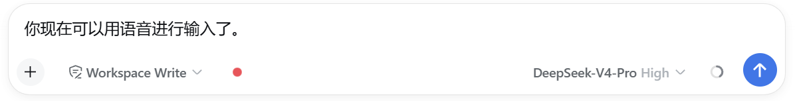

<p align="center"></p>

<h1 align="center">voicelens 🎙️</h1>
<p align="center"><b>给文本模型装上「耳朵」——说人话，AI 就听得懂了。</b></p>

<p align="center">
  <a href="https://github.com/EthanHuangEbor/VoiceLens/blob/main/LICENSE"></a>
  
  
</p>

---

## 为什么做这个

跟 AI 聊天，绝大多数时候你还是得打字。

想躺着聊？想一边喝咖啡一边口述一段思路？想偷懒？—— 打开输入框，旁边多了个小喇叭，**点一下，直接说。每停顿一下，刚说的那句话就自动落进输入框**，说到哪儿你都看得见。

就这么简单，不用训练，不用改习惯。

## 它现在能干嘛

- 🎙️ **边说边出字**：说话时字词实时浮现在喇叭上方，**每断一句立刻写入输入框**——不再是"录完了才一次性蹦出来一大段"。
- 📝 **模型也能转写音频**：扔给它一个音频文件或链接，`transcribe_audio` 工具直接转成文字证据。
- 🖥️ **不只在 DSH 能用**：同一个引擎打包成了 `voicelens` 命令行，Claude Code / Codex / Pi / OpenClaw 里的 agent 读同一份技能就能用。
- 🔌 **转写引擎随便换**：Groq（免费）/ OpenAI 兼容端点 / 本地 whisper.cpp，一份配置，所有宿主共享。

<p align="center"></p>

## 快速上手

```bash
# DSH 原生插件（麦克风按钮 + transcribe_audio 工具）
dsh plugin --profile web add voicelens

# 或装 CLI（任何宿主都能用）
npm install -g voicelens
```

装完刷新页面，输入框左边就是那个小喇叭。点一下，说话。

## 浏览器支持（实话实说）

| 浏览器 | 体验 |
| --- | --- |
| Chrome / Edge | ✅ 零配置，浏览器原生语音识别，开箱即用 |
| Firefox / Safari | ✅ 也能用，走「录音 → Host 转写」通道，**需要先配一个转写引擎**（见下） |
| 其他 | 只要支持麦克风录音，基本都能跑 |

## 配置转写引擎（给 Firefox 和文件转写用）

```bash
export VOICELENS_PROVIDER=groq
export VOICELENS_GROQ_API_KEY=gsk_...   # 免费申请，个人用绰绰有余
```

Chrome / Edge 用户这一步可以跳过——浏览器自带识别，不要钱不要 key。

## 架构：站在巨人的肩膀上

一句话：把 [modlens](https://github.com/liustack/modlens) 那套「一个引擎、多端适配」的思路，从视觉搬到了语音。

<p align="center"></p>

modlens 证明了一件事：**核心引擎（CLI + 多 provider）+ 一份通用技能 + 各平台薄薄一层原生适配**，就能让一个能力到处跑。voicelens 照搬了这个套路，只是把「读图」换成了「听话」。

唯一绕不开的差别是：图片能靠「粘贴」进入所有宿主，语音没有这条现成通道——所以 DSH 里多了个麦克风按钮，这是必须自己补的一小块。模型侧的文件转写，则是天然的多平台。

## 致谢

这个项目能长出来，得真心谢谢两个项目：

- **[modlens](https://github.com/liustack/modlens)** —— 架构的蓝本。三层分离、provider 接口、分层配置、doctor 诊断，几乎都是跟它学的。作者 [@liustack](https://github.com/liustack) 的思路，我"抄"得很开心，也抄得理直气壮——好设计就该被复用。
- **[DeepSeek Harness (DSH)](https://github.com/deepseek-ai/deepseek-harness)** —— 开放的插件体系（bundle/client 清单、Slots 插槽、llm 服务……）让「语音输入」能做成一个干净的原生插件，而不是一堆 hack。

没有这俩项目，就没有 voicelens。Respect。🙏

## License

MIT，随便用，别客气。
